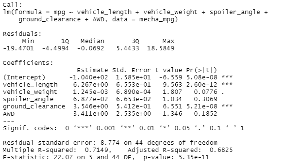
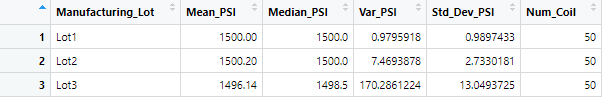
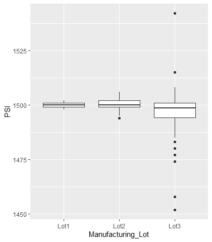

# MechaCar_Statistical_Analysis

## Overview of Project
A few weeks after starting his new role, Jeremy is approached by upper management about a special project. AutosRUs’ newest prototype, the MechaCar, is suffering from production troubles that are blocking the manufacturing team’s progress. AutosRUs’ upper management has called on Jeremy and the data analytics team to review the production data for insights that may help the manufacturing team.

In this challenge, you’ll help Jeremy and the data analytics team do the following:

Perform multiple linear regression analysis to identify which variables in the dataset predict the mpg of MechaCar prototypes
Collect summary statistics on the pounds per square inch (PSI) of the suspension coils from the manufacturing lots
Run t-tests to determine if the manufacturing lots are statistically different from the mean population
Design a statistical study to compare vehicle performance of the MechaCar vehicles against vehicles from other manufacturers. For each statistical analysis, you’ll write a summary interpretation of the findings.

## Deliverables:
This new assignment consists of three technical analysis deliverables and a proposal for further statistical study. You’ll submit the following:

1. ***Deliverable 1:*** Linear Regression to Predict MPG
2. ***Deliverable 2:*** Summary Statistics on Suspension Coils
3. ***Deliverable 3:*** T-Test on Suspension Coils
4. ***Deliverable 4:*** Design a Study Comparing the MechaCar to the Competition

# Deliverable 1:  
## Linear Regression to Predict MPG

### mpg =  (6.267)**vehicle_length** + (0.0012)**vehicle_weight** + (0.0688)**spoiler_angle** + (3.546)**ground_clearance** + (-3.411)**AWD** + (-104.0)
				

**Summary:** 

we notice that The p-Value is much smaller than the assumed significance level of 0.05.this means we have enough evidence to reject the null Hypothesis and that the slope is not zero. In additon , we can notice tht Vehicle length and and ground clearance have an impact on MPG. Furthermore, we have an r-squared value of 0.7149,  meaning that around 71% of all mpg predictions will be determined by this model.

# Deliverable 2:  
## Summary Statistics on Suspension Coils
 
 

its cleat that the variance of the coils is 62.29 PSI, which is well within the 100 PSI variance requirement.  

Lot 1 and Lot 2 with variances of 0.98 and 7.47 respectively are  within the 100 PSI variance requirement;However, it is Lot 3,with a variance of 170.29, has a higher variance 

# Deliverable 3:  
## t-Tests on Suspension Coils

We can clearly see that  the mean of the sample is 1498.78 and a p-Value of 0.06 which is higher than the common significance level of 0.05, there is **NOT enough evidence to support rejecting the null hypothesis**.  That is to say, the mean of all three of these manufacturing lots is statistically similar to the presumed population mean of 1500. 

**Next looking at each individual lots:**

1. Lot 1 sample actually has the **true sample mean of 1500**, again as we saw in the summary statistics above. With a **p-Value of 1**, clearly we cannot reject (i.e. accept) the null hypothesis that there is no statistical difference between the observed sample mean and the presumed population mean (1500).
2. Lot 2 has essentially the same outcome with a **sample mean of 1500.02**, a **p-Value of 0.61**; the null hypothesis cannot be rejected, and the sample mean and the population mean of 1500 are statistically similar.
3. However, Lot 3, not surprisingly is a different scenario. Here **the sample mean is 1496.14** and the **p-Value is 0.04**, which is lower than the common significance level of 0.05.  All indicating to **reject the null hypothesis** that this sample mean and the presumed population mean are not statistically different.

 

How does this information help?  Clearly, something went awry in Lot 3's production cycle. The process needs to be checked for system fails and the suspension coils from this lot need to be inspected to remove those not meeting quality criteria.

# Deliverable 4:  
## Study Design: MechaCar vs Competition
### Deliverable Requirements:

Using your knowledge of R, design a statistical study to compare performance of the MechaCar vehicles against performance of vehicles from other manufacturers.

The statistical study design has the following:
- A metric to be tested is mentioned
- A null hypothesis or an alternative hypothesis is described
- A statistical test is described to test the hypothesis

This study would involve collecting data on MechaCar and its comparable models across several different manufacturers over the last 3 years.

* What are the competitions' comparable models, 
* Which cars will MechaCar be competing with head-to-head? which cars will be included in the study?
* Which factors will look at the study to determine the relevant to selling price?
 

#### Metrics
Collecting data for comparable models across all major manufacturers for past 3 years for the following metrics:

*  Safety Feature Rating: **Independent Variable**
*  Current Price (Selling): **Dependent Variable**
*  Drive Package : **Independent Variable**
*  Engine (Electric, Hybrid, Gasoline / Conventional): **Independent Variable**
*  Resale Value: **Independent Variable**
*  Average Annual Cost of ownership (Maintenance): **Independent Variable**
*  MPG (Gasoline Efficiency): **Independent Variable**

#### Hypothesis: Null and Alternative
After determining which factors are key for the MechaCar's genre:

 * Null Hypothesis (Ho): MechaCar is priced correctly based on its performance of key factors for its genre.
 * Alternative Hypothesis (Ha): MechaCar is NOT priced correctly based on performance of key factors for its genre.
 
#### Statistical Tests
A **multiple linear regression** would be used to determine the factors that have the highest correlation/predictability with the list selling price (dependent variable); which combination has the greatest impact on price (it may be all of them!)

##### MechaCar Analysis - AutosRUs Completed by Emmanuel Martinez
