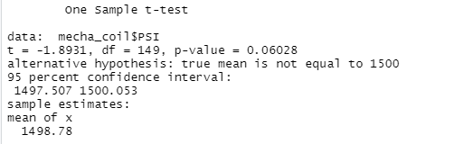

# MechaCar_Statistical_Analysis

## Overview of Project
A few weeks after starting his new role, Jeremy is approached by upper management about a special project. AutosRUs’ newest prototype, the MechaCar, is suffering from production troubles that are blocking the manufacturing team’s progress. AutosRUs’ upper management has called on Jeremy and the data analytics team to review the production data for insights that may help the manufacturing team.

In this challenge, you’ll help Jeremy and the data analytics team do the following:

Perform multiple linear regression analysis to identify which variables in the dataset predict the mpg of MechaCar prototypes
Collect summary statistics on the pounds per square inch (PSI) of the suspension coils from the manufacturing lots
Run t-tests to determine if the manufacturing lots are statistically different from the mean population
Design a statistical study to compare vehicle performance of the MechaCar vehicles against vehicles from other manufacturers. For each statistical analysis, you’ll write a summary interpretation of the findings.

## Deliverables:
This new assignment consists of three technical analysis deliverables and a proposal for further statistical study. You’ll submit the following:

1. ***Deliverable 1:*** Linear Regression to Predict MPG
2. ***Deliverable 2:*** Summary Statistics on Suspension Coils
3. ***Deliverable 3:*** T-Test on Suspension Coils
4. ***Deliverable 4:*** Design a Study Comparing the MechaCar to the Competition

# Deliverable 1:  
## Linear Regression to Predict MPG

### mpg =  (6.267)**vehicle_length** + (0.0012)**vehicle_weight** + (0.0688)**spoiler_angle** + (3.546)**ground_clearance** + (-3.411)**AWD** + (-104.0)
				

**Summary:** 

we notice that The p-Value is much smaller than the assumed significance level of 0.05.this means we have enough evidence to reject the null Hypothesis and that the slope is not zero. In additon , we can notice tht Vehicle length and and ground clearance have an impact on MPG. Furthermore, we have an r-squared value of 0.7149,  meaning that around 71% of all mpg predictions will be determined by this model.

# Deliverable 2:  
## Summary Statistics on Suspension Coils
 
 

its cleat that the variance of the coils is 62.29 PSI, which is well within the 100 PSI variance requirement.  

Lot 1 and Lot 2 with variances of 0.98 and 7.47 respectively are  within the 100 PSI variance requirement;However, it is Lot 3,with a variance of 170.29, has a higher variance 

# Deliverable 3:  
## t-Tests on Suspension Coils

the mean of the sample is 1498.78 and a p-Value of 0.06 which is greater than the  significance level of 0.05, there is NOT enough evidence to support rejecting the null hypothesis.
 
 

Lot 1  actually has a mean of 1500. With a p-Value of 1,  we certainly cannot reject  the NULL hypothesis .in Lot 2 it has a mean of 1500.02 and a p-Value of 0.61;we cannot reject the NULL hypothesis.On the Other hand, Lot 3 has a mean of 1496.14 and a p-Value is 0.04 which is lower than the common significance level of 0.05.which tells us to reject the NULL Hypothesis.

in Lot 3 cycle, the process should be examined further and coils should be inspected.

# Deliverable 4:  
## Study Design: MechaCar vs Competition

### **Setting Hypothesis**
 **Null Hypothesis** : prototype is priced correctly
 **Alternative Hypothesis** : prototype is NOT priced correctly 

### **What metric or metrics are you going to test?**

Safety Feature Rating
Current Price (Selling)
Resale Value: Independent Variable
Engine : Independent Variable
MPG 

### **statistical test to be used to test hypothesis**

the t-test to compare our dataset with the competitors and a multiple linear regression.

### **Data for statistical testing to be used**
competitors models from different manufaturers over the last few years and how do they compare with Mechacar.

